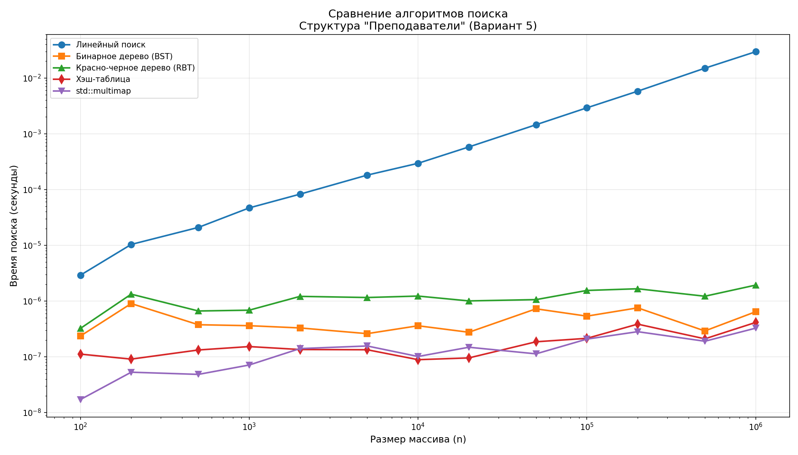
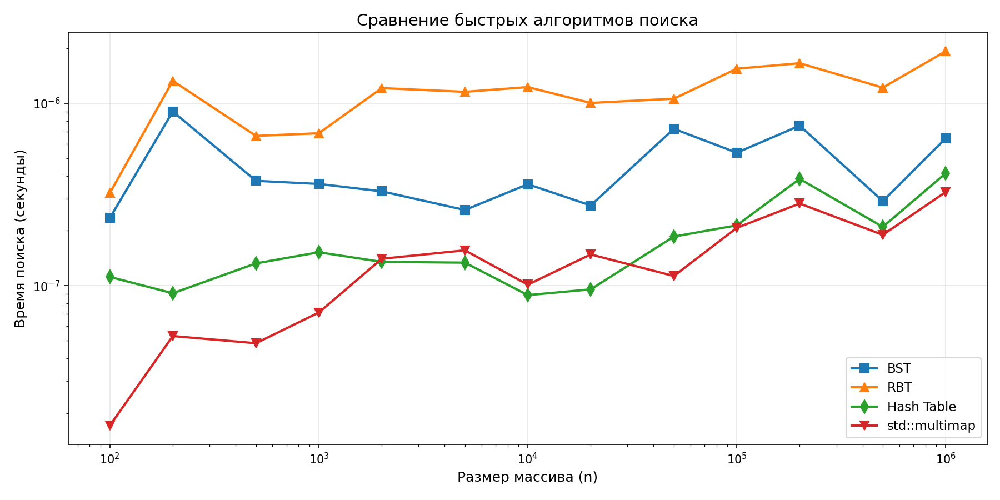
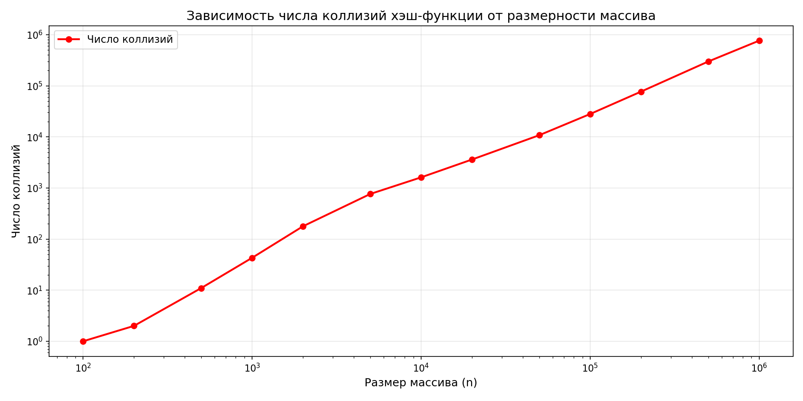
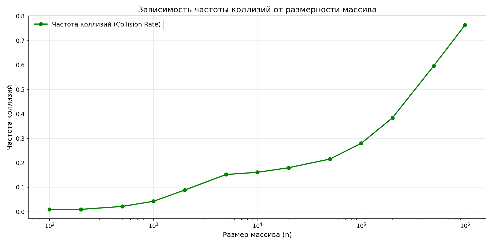

# Лабораторная работа №2: Сравнение алгоритмов поиска

- **Структура данных:** Преподаватели (ФИО, факультет, учёное звание, учёная степень)
- **Ключ поиска:** ФИО (первое не числовое поле)
- **Алгоритмы поиска:**
  - Линейный поиск (O(n))
  - Бинарное дерево поиска (BST) (O(log n) в среднем)
  - Красно-черное дерево (RBT) (O(log n) всегда)
  - Хэш-таблица (O(1) в среднем)
  - std::multimap (O(log n)) — для сравнения

### Сравнение времени поиска (секунды)

| Размер (Size) | Линейный (Linear) | Бинарное дерево (BST) | Красно-черное дерево (RBT) | Хэш-таблица (Hash) | std::multimap |
|:---|:---|:---|:---|:---|:---|
| **100** | 2.91e-06 | 2.35e-07 | 3.23e-07 | 1.12e-07 | 1.71e-08 |
| **200** | 1.03e-05 | 9.01e-07 | 1.33e-06 | 9.08e-08 | 5.29e-08 |
| **500** | 2.09e-05 | 3.76e-07 | 6.63e-07 | 1.33e-07 | 4.83e-08 |
| **1 000** | 4.68e-05 | 3.61e-07 | 6.85e-07 | 1.53e-07 | 7.13e-08 |
| **2 000** | 8.26e-05 | 3.29e-07 | 1.21e-06 | 1.35e-07 | 1.40e-07 |
| **5 000** | 1.81e-04 | 2.60e-07 | 1.16e-06 | 1.34e-07 | 1.56e-07 |
| **10 000** | 2.95e-04 | 3.60e-07 | 1.23e-06 | 8.88e-08 | 1.01e-07 |
| **20 000** | 5.80e-04 | 2.75e-07 | 1.01e-06 | 9.54e-08 | 1.48e-07 |
| **50 000** | 1.45e-03 | 7.25e-07 | 1.06e-06 | 1.86e-07 | 1.13e-07 |
| **100 000** | 2.92e-03 | 5.36e-07 | 1.55e-06 | 2.14e-07 | 2.08e-07 |
| **200 000** | 5.80e-03 | 7.55e-07 | 1.66e-06 | 3.85e-07 | 2.82e-07 |
| **500 000** | 1.50e-02 | 2.91e-07 | 1.22e-06 | 2.10e-07 | 1.90e-07 |
| **1 000 000** | 2.96e-02 | 6.43e-07 | 1.93e-06 | 4.13e-07 | 3.26e-07 |

### Сравнение коллизий в Хэш-таблице (Оптимизированная версия)

| Размер (Size) | Число коллизий (Collisions) | Всего вставок (Total Inserts) | Частота коллизий (Collision Rate) |
|:---|:---|:---|:---|
| **100** | 1 | 100 | 1.00% |
| **200** | 2 | 200 | 1.00% |
| **500** | 11 | 500 | 2.20% |
| **1 000** | 43 | 1000 | 4.30% |
| **2 000** | 178 | 2000 | 8.90% |
| **5 000** | 763 | 5000 | 15.26% |
| **10 000** | 1615 | 10000 | 16.15% |
| **20 000** | 3606 | 20000 | 18.03% |
| **50 000** | 10789 | 50000 | 21.58% |
| **100 000** | 28026 | 100000 | 28.03% |
| **200 000** | 76897 | 200000 | 38.45% |
| **500 000** | 298706 | 500000 | 59.74% |
| **1 000 000** | 764366 | 1000000 | 76.44% |

### Графики

#### Временные характеристики
- **Сравнение всех алгоритмов:** 
- **Только быстрые алгоритмы (O(log n) и O(1)):** 

#### Статистика коллизий
- **Количество коллизий хэш-таблицы:** 
- **Доля коллизий хэш-таблицы (Collision Rate):** 


### Сборка

```bash
mkdir build && cd build
cmake ..
make
./search_test
```

#### Открыть документацию

```bash
open docs/html/index.html
```
